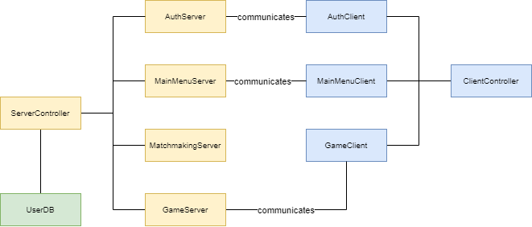

# Distributed Systems - Assignment 2

This document contains the running instructions, as well some mentions to our implementation of a client-server system using TCP sockets in Java.

## Authors

- [Pedro Rafael Angélico Madureira](https://github.com/pramadureira)
- [Sofia Vieira Pinto](https://github.com/SofiaViP)
- [Tomás Carvalho Gaspar](https://github.com/Tomas-Gaspar)

## Running Instructions

To start the online game server, after downloading the zip file containing this project, follow these steps:

1. Open a terminal window.

2. Navigate to the directory containing the source code for the second assignment:
    ```
    cd assign2/src
    ```

3. Start the server by typing the following command:
    ```
    java ServerController.java 8000
    ```
    If the output `Server is listening on port 8000` appears, your server has started correctly.

4. Open a new terminal window and, once again, navigate to the directory containing the source code for the second assignment:
    ```
    cd assign2/src
    ```

5. Start a client by typing the following command:
    ```
    java ClientController.java localhost 8000
    ```
    If you see a `Welcome` banner, your client has started correctly.

6. Repeat steps `4.` and `5.` for as many clients as you wish to connect to the server.

## Implementation Details

### Architecture

In this section, we will explore the architecture of our system, as depicted in the image below:



- **ServerController**: It's the main server controller for our game. It sets up a server socket, listens for incoming client connections, and handles user authentication and matchmaking. It also manages game sessions, including ranked and unranked matches, and handles user disconnections and shutdowns. The server uses multithreading to handle multiple clients simultaneously.

- **ClientController**: It connects to a server using a hostname and port number provided as arguments. It then creates an authentication client and a main menu client, and starts a loop where it waits for responses from the main menu. Depending on the response, it either handles a heartbeat signal, starts a game client, continues to the next iteration of the loop, or exits the loop. It also handles exceptions for unknown hosts and I/O errors. The handleHeartbeat method listens for "HEARTBEAT" or "MATCHED" messages from the server and responds accordingly.

- **Auth**: The AuthClient and AuthServer work together to handle user authentication in this networked application. The client collects user credentials and sends them to the server, which verifies them against a UserDB object and sends back a response. This communication ensures secure and efficient user authentication.

- **MainMenu**: The MainMenuClient and MainMenuServer are responsible for the main menu interactions in the system. The client reads user choices and sends them to the server, which processes them and triggers an action (e.g. display the leaderboard). This communication ensures a smooth and interactive user experience in the main menu of the game.

- **Game**: The GameClient and GameServer deal with the game interactions in this networked guessing game application. The client collects user guesses and sends them to the server, which processes them, calculates results based on an adaptation of the ELO strategy, updates player rankings, and sends back a response. 

- **MatchmakingServer**: The MatchmakingServer maintains two queues of players: one for ranked matches (matchmakingQueue) and one for unranked matches (unrankedQueue). The former relates to the [Simple Matchmaking](####Simple) system, while the latter is associated with the [Rank Matchmaking](####Rank) approach.

- **UserDB**: Keeps the data of all registered users in a CSV file, namely, the username, hashed password, salt and the ELO.

### Authentication

We require the user to register/login into the system before using it. Furthermore, we register in a separate file all the user data and, to increase safety, we store hashed passwords using the SHA-512 cipher with salt.

### Matchmaking

#### Simple

As the maximum number of players required for a game to start is 6, in the Simple Matchmaking approach, the server waits for 6 people to join the queue, and then groups them together to start a game.

#### Rank

The Rank Matchmaking approach uses players' ELO ratings to create balanced games, ensuring that all players in a match have similar skill levels. To prevent long wait times, the system gradually relaxes its matching criteria over time, allowing players to join games even if a perfect ELO match is not found, thus avoiding starvation.

### Fault Tolerence

When players are waiting to find a match, a heartbeat protocol ensures that matches aren't created with clients that have lost their connection. If the heartbeat protocol detects a broken connection, the player is not removed from the queue but is marked as not present. This way, if the client reenters the queue, their position is preserved.

### Concurrency
We used a reentrant lock to ensure thread safety and race conditions. This lock manages access to shared data structures, allowing multiple threads to synchronize effectively without conflicts. 

To prevent slow clients from causing system-wide delays, timeout mechanisms were implemented, particularly in the heartbeat protocol and the guessing functionality.

### Game

Since the primary objective of this project wasn't game development, we chose to create a straightforward guessing game. In this game, players are ranked based on the proximity of their guess to a randomly generated number between 0 and 100. Scores are adjusted using a method akin to the ELO rating system employed in chess.

The game requires a minimum of 2 players to start and can accommodate up to 6 players. However, the maximum number of players can be adjusted by modifying a variable in the code.
